# דוח שלב א׳ - מודול משתמשים בסטרימינג

**מגישים:** ישי זיגדון, יצחק הלל זעפרני\
**מערכת:** שירות צפייה בסטרימינג\
**יחידה נבחרת:** מודול משתמשים

---

## תוכן עניינים

1. [מבוא](#מבוא)
2. [תרשימי ERD ו-DSD](#תרשימי-erd-ו-dsd)
3. [החלטות עיצוב ונימוקים](#החלטות-עיצוב-ונימוקים)
4. [שיטות הכנסת נתונים](#שיטות-הכנסת-נתונים)
5. [גיבוי ושחזור](#גיבוי-ושחזור)

---

## מבוא

במערכת שירות הזרמת התוכן אנו מנהלים נתונים על משתמשים, מנויים, פרופילים, היסטוריית צפייה, רשימות צפייה והעדפות פרופיל.\
המטרה העיקרית היא לאפשר:

- רישום וניהול משתמשים ומנויים.
- טיוב התכנים בהתאם לפרופילים השונים.
- מעקב אחרי דפוסי צפייה לצורך המלצות והפקת דוחות.

---

## תרשימי ERD ו-DSD

להלן תרשימי ה-Entity Relationship Diagram ו-Data Structure Diagram עבור מודול המשתמשים:

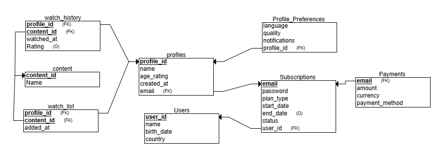

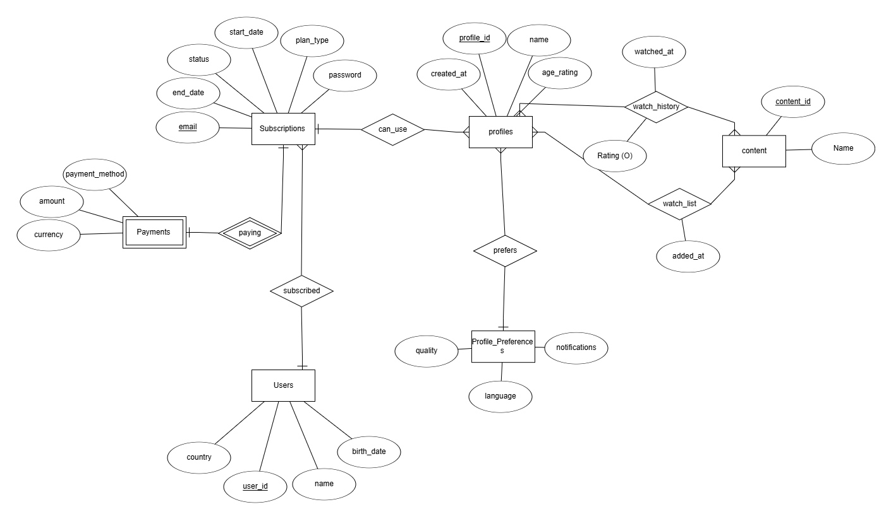

\

---

## החלטות עיצוב ונימוקים

- **Users**: טבלת המשתמשים מכילה שדות `user_id`, `name`, `birth_date`, `country`. החלטנו שהשדה `user_id` יהיה מפתח ראשי אוטומטי (serial) כדי להבטיח ייחודיות ושמירה על עקביות.
- **Subscriptions**: טבלה זו מחברת בין `user_id` לכתובת `email`, וכוללת שדות `plan_type`, `start_date`, `end_date`, `status`, `password`. שימוש ב-`email` כמפתח זר מאפשר אימות משתמש אחיד.
- **Profiles**: טבלת הפרופילים כוללת `profile_id`, `name`, `age_rating`, `created_at`, `email`. החלטנו לקשר פרופילים למנויים דרך `email` כדי לאפשר לכל משתמש מספר פרופילים.
- **Watch\_History**: טבלת היסטוריית הצפייה כוללת `watched_at`, `Rating`, `profile_id`, `content_id`. שמירת הזמן והדירוג מאפשרת ניתוח התנהגות ומידול המלצות.
- **Watch\_List**: טבלה זו מתעדת תכנים שהפרופיל סימן למעקב (`added_at`, `profile_id`, `content_id`). הפרדה מ-`watch_history` נועדה לשפר ביצועים בשאילתות בדיקה.
- **Profile\_Preferences**: מכילה `language`, `quality`, `notifications`, `profile_id`. שימוש בטבלה נפרדת מאפשר הרחבה עתידית של הגדרות משתמש ללא פגיעה בטבלאות אחרות.
- **Content**: טבלת התכנים כוללת `content_id`, `Name`. אחסון מינימלי עבור תכנים מאפשר מרחב להרחיב שדות נוספים (קטגוריה, תיאור) בעתיד.
- **Payments**: טבלה זו כוללת `amount`, `currency`, `payment_method`, `email`. החלטנו להשתמש ב-`email` לקישור לתשלומים כדי לשמר היסטוריית תשלום ללא שינוי במפתח הראשי.

---

## שיטות הכנסת נתונים

1. **טעינת CSV באמצעות ****`COPY FROM`****:**

2. **סקריפט Python לאוטומציה:**
   
3. **פקודות ****`INSERT`****:**
   - צילום מסך של הוספה ידנית ב-SQL client.

---

*זהו מסמך התשתית לשלב א׳.*

---

## חלק ב׳: תיעוד ביצוע שאילתות ושינויים

### שאילתות SELECT
עבור כל שאילתת SELECT יש לכלול כותרת, תיאור מלא ורווח לתמונות:

1. **חיפוש משתמשים עם יותר מ-2 פרופילים**  
   - **תיאור בעברית:** שאילתה זו מאתרת משתמשים המחוברים ללפחות שלושה פרופילים שונים, מציגה את מזהה המשתמש, שמו, ארצו ומספר הפרופילים שלהם. שימוש בשאילתה מסייע בזיהוי משתמשים שמנצלים את הפלטפורמה ביותר מפרופיל אחד לצורך התאמה אישית.  
2. **סדרות/סרטים שצפו בהם ב-2024**  
   - **תיאור בעברית:** מביאה פרטי צפייה עבור כל צפייה שבוצעה בשנת 2024, כולל שם הפרופיל, תאריך הצפייה, שם התוכן והדירוג שהוענק. שימוש במידע מאפשר ניתוח מגמות צפייה עונתיות.  
3. **ממוצע דירוג לכל פרופיל עם ממוצע ≥ 8**  
   - **תיאור בעברית:** מחשבת את ממוצע הדירוגים לכל פרופיל ומחזירה רק פרופילים עם דירוג ממוצע של שמונה ומעלה. מאפשר לזהות פרופילים עם חווית צפייה חיובית למטרות שיווק.  
4. **משתמשים עם מנוי פעיל מתחילת השנה**  
   - **תיאור בעברית:** שולפת משתמשים שמצב מנויים שלהם פעיל מאז תחילת השנה, כולל סוג התוכנית ותאריך תחילת המנוי. עוזרת לעקוב אחר שמירת משתמשים (retention).  
5. **תכנים ב-watch_list שלא נצפו**  
   - **תיאור בעברית:** מאתרת תכנים שהוסיף הפרופיל לרשימת צפייה אך עדיין לא נצפו, כולל תאריך הוספה. מאפשרת תזכורות והמלצות משלימות לצפייה.  
6. **פילוח פרופילים לפי חודש ושנה של יצירתם**  
   - **תיאור בעברית:** מסכמת כמות פרופילים שנוצרו בכל חודש ושנה, לחקר צמיחה חודשית של השירות.  
7. **ספירת פרופילים לפי שפות מועדפות**  
   - **תיאור בעברית:** מחשבת כמה פרופילים בחרו כל שפה כהעדפה, עוזר לתעדוף ממשק משתמש לפי שפה.  
8. **5 התכנים הפופולריים ביותר**  
   - **תיאור בעברית:** מוצאת חמשת התכנים עם מספר הצפיות הגבוה ביותר, לרשימות Top10 ולקמפיינים שיווקיים.  

### שאילתות DELETE ו-UPDATE ו-UPDATE ו-UPDATE

ו-UPDATE
עבור כל שאילתת DELETE ו-UPDATE שבקובץ `Queries.sql` יש לכלול בדו"ח:

1. **תיאור בעברית:** שאילתת DELETE או UPDATE זו מבצעת את הפעולה הנחוצה (מחיקה או עדכון) בטבלה הנכונה, כדי להבטיח עקביות ותקינות בנתונים; למשל, מחיקת רשומות לא תקניות מתוך `profile_preferences` או עדכון סטטוס של מנוי שפג תוקפו.
2. **צילום מסך של מצב בסיס הנתונים לפני השינוי** (תצוגת טבלה).

**DELETE**

**1**

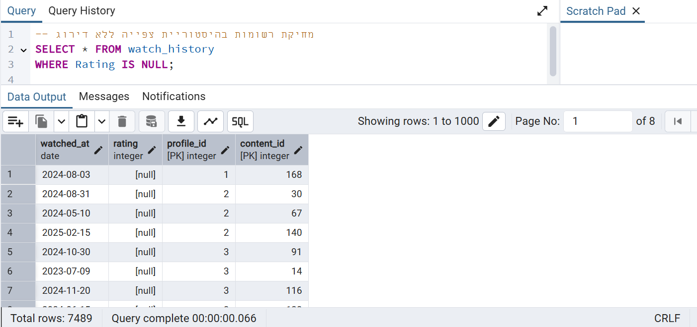

**2**

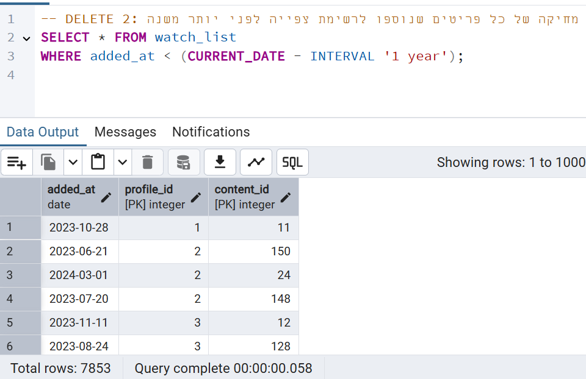

**3**

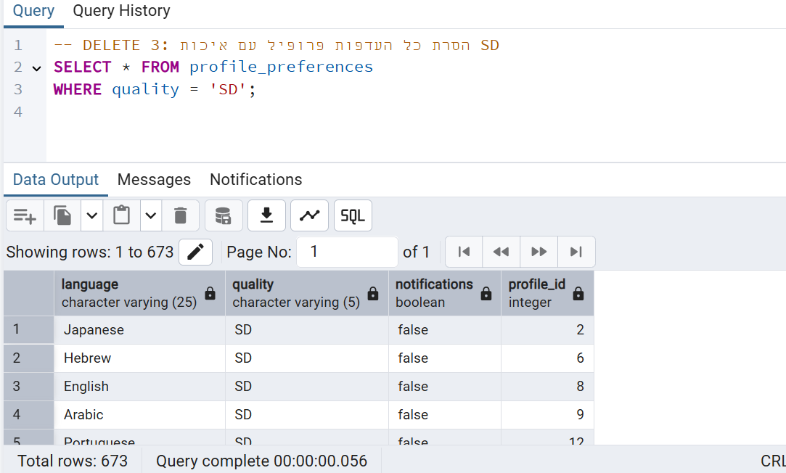

3. **צילום מסך של הרצת השאילתה**.
**1**

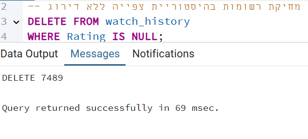

**2**

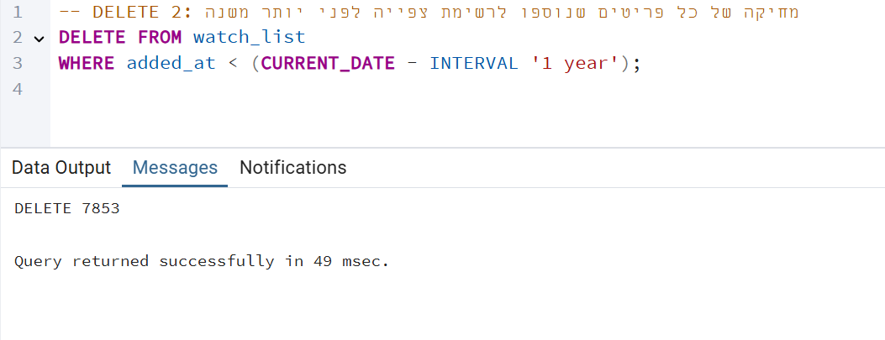

**3**

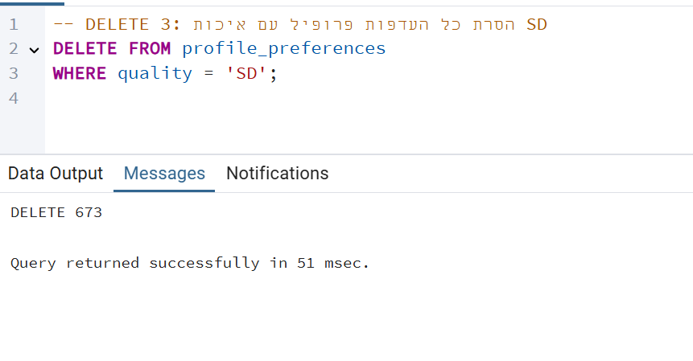

4. **צילום מסך של מצב בסיס הנתונים אחרי השינוי**.
**1**

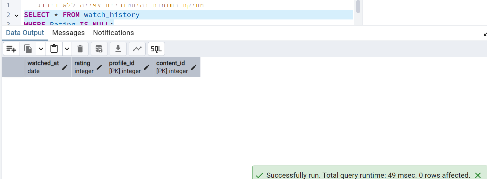

**2**

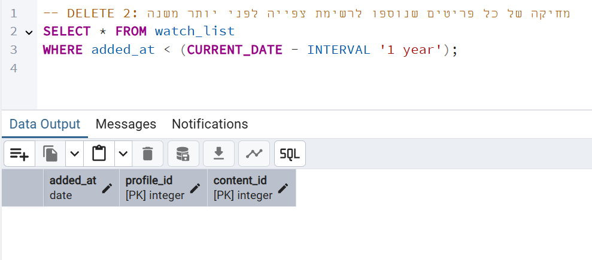

**3**

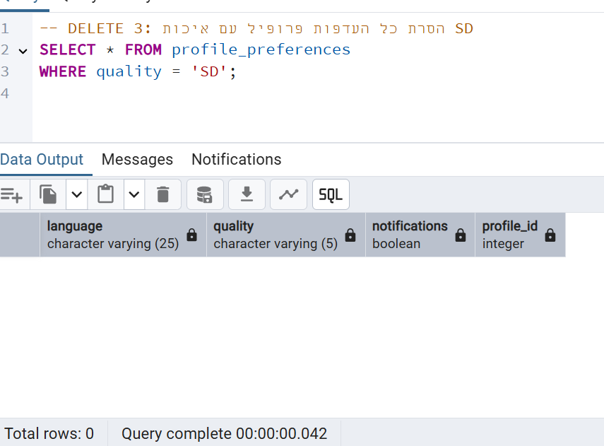

**UPDATE**

**צילום מסך של מצב בסיס הנתונים לפני השינוי** (תצוגת טבלה).

**1**

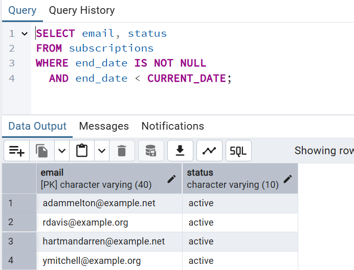

**2**

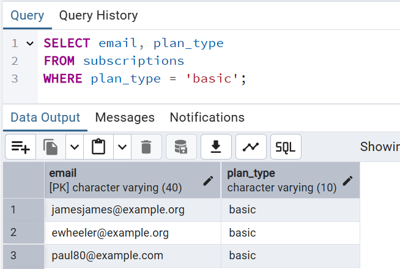

**3**

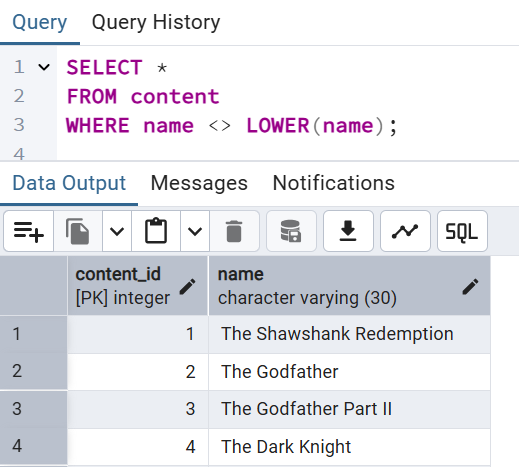
**צילום מסך של הרצת השאילתה**.

**1**

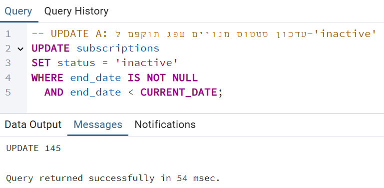

**2**

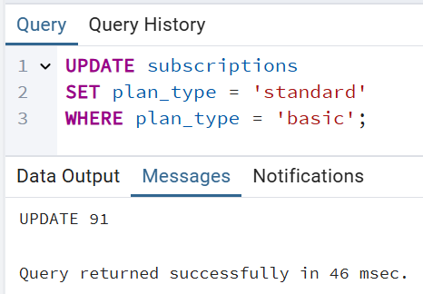

**3**

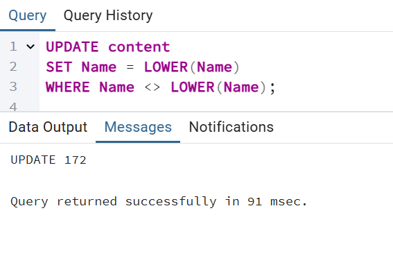

 **צילום מסך של מצב בסיס הנתונים אחרי השינוי**.

**1**

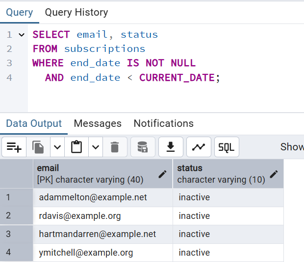

**2**

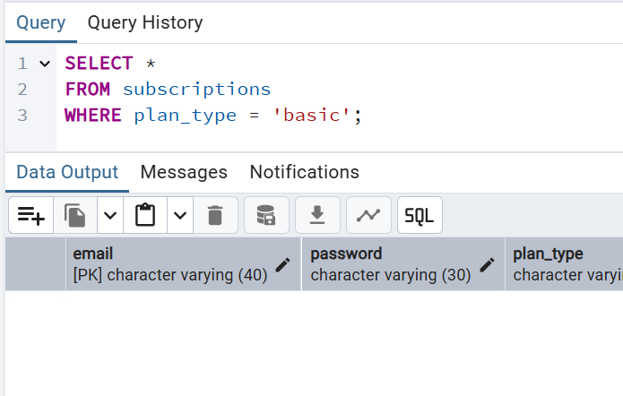

**3**

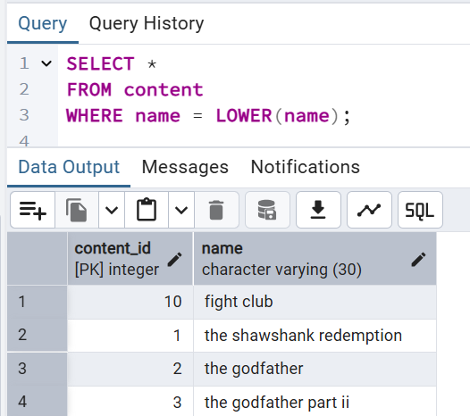
### אילוצים (Constraints)

עבור כל אילוץ שבקובץ `Constraints.sql` יש:

1. **תיאור השינוי בעברית** שהתווסף באמצעות `ALTER TABLE`.
2. **צילום מסך של הרצת הפקודה**.
3. **ניסיון ליצירת נתון שסותר את האילוץ** וצילום השגיאה המתקבלת.

### דוגמאות ROLLBACK ו-COMMIT
עבור הדוגמאות שבקובץ `RollbackCommit.sql` יש להראות:
1. **תיאור קצר בעברית (ROLLBACK):** ביטול כל השינויים בטרנזקציה וחזרה למצב הקודם.
2. **תיאור קצר בעברית (COMMIT):** שמירת כל השינויים שבוצעו בטרנזקציה לצמיתות.
3. **צילום מצב בסיס הנתונים לפני הפעולה:**  
     
4. **צילום מסך של הרצת הפקודה:**  
     
5. **צילום מצב בסיס הנתונים אחרי הפעולה:**  
   

