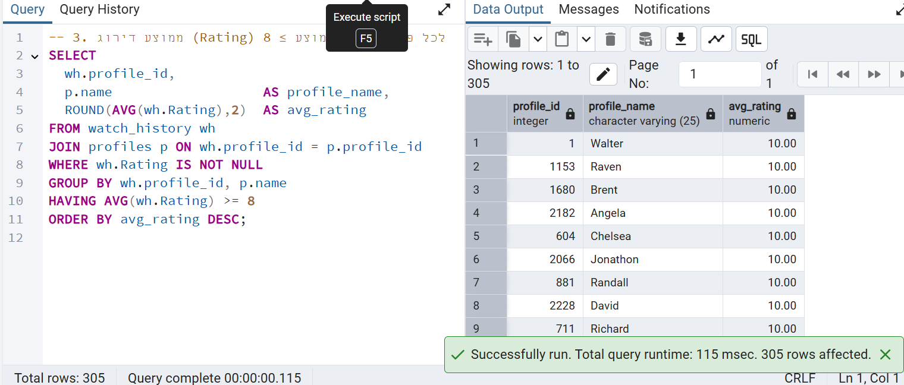
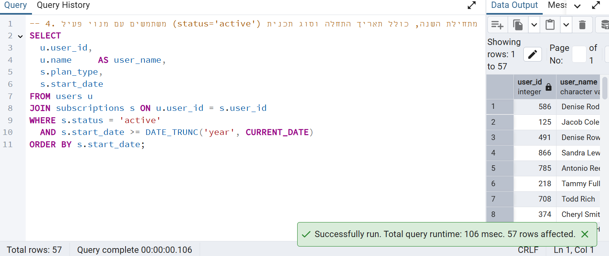
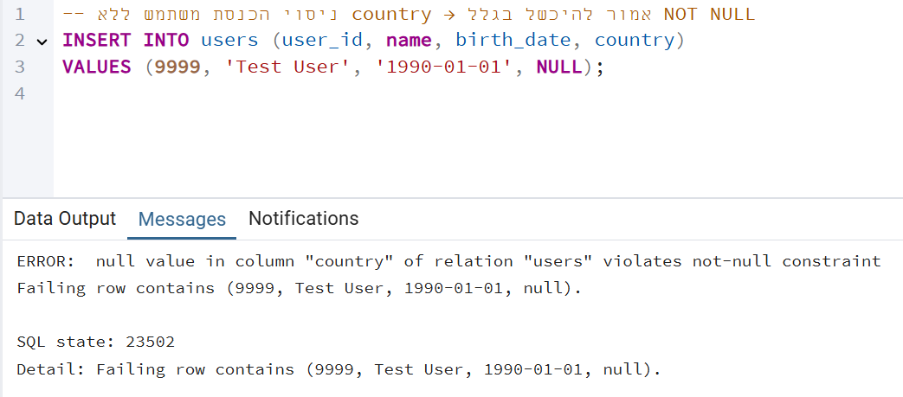
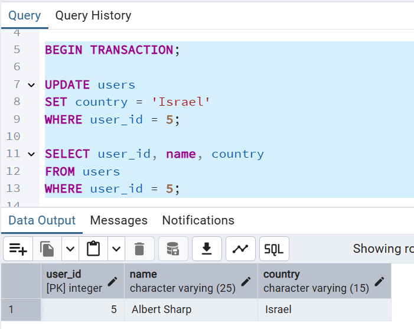
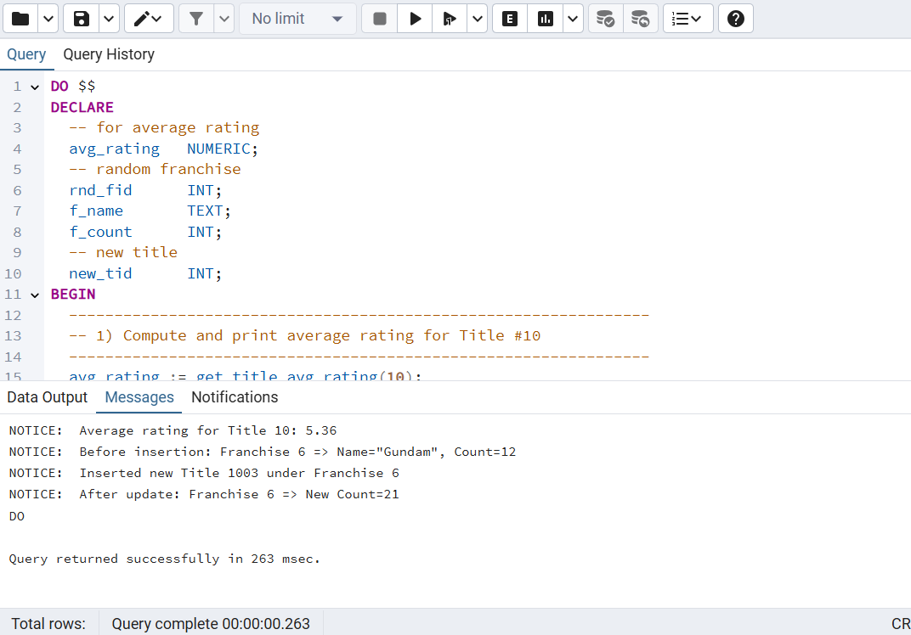
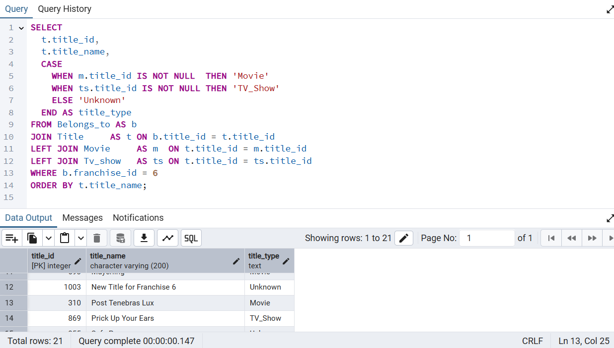
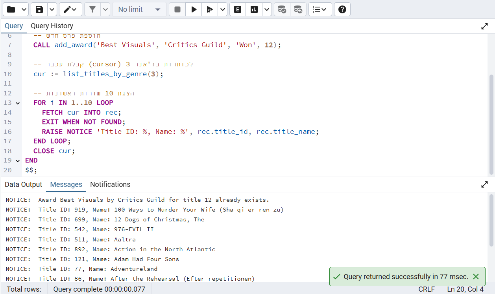

# דוח שלב א׳ - מודול משתמשים בסטרימינג

**מגישים:** ישי זיגדון, יצחק הלל זעפרני\
**מערכת:** שירות צפייה בסטרימינג\
**יחידה נבחרת:** מודול משתמשים

---

## תוכן עניינים

1. [מבוא](#מבוא)
2. [תרשימי ERD ו-DSD](#תרשימי-erd-ו-dsd)
3. [החלטות עיצוב ונימוקים](#החלטות-עיצוב-ונימוקים)
4. [שיטות הכנסת נתונים](#שיטות-הכנסת-נתונים)
5. [גיבוי ושחזור](#גיבוי-ושחזור)

---

## מבוא

במערכת שירות הזרמת התוכן אנו מנהלים נתונים על משתמשים, מנויים, פרופילים, היסטוריית צפייה, רשימות צפייה והעדפות פרופיל.\
המטרה העיקרית היא לאפשר:

- רישום וניהול משתמשים ומנויים.
- טיוב התכנים בהתאם לפרופילים השונים.
- מעקב אחרי דפוסי צפייה לצורך המלצות והפקת דוחות.

---

## תרשימי ERD ו-DSD

להלן תרשימי ה-Entity Relationship Diagram ו-Data Structure Diagram עבור מודול המשתמשים:


\


---

## החלטות עיצוב ונימוקים

- **Users**: טבלת המשתמשים מכילה שדות `user_id`, `name`, `birth_date`, `country`. החלטנו שהשדה `user_id` יהיה מפתח ראשי אוטומטי (serial) כדי להבטיח ייחודיות ושמירה על עקביות.
- **Subscriptions**: טבלה זו מחברת בין `user_id` לכתובת `email`, וכוללת שדות `plan_type`, `start_date`, `end_date`, `status`, `password`. שימוש ב-`email` כמפתח זר מאפשר אימות משתמש אחיד.
- **Profiles**: טבלת הפרופילים כוללת `profile_id`, `name`, `age_rating`, `created_at`, `email`. החלטנו לקשר פרופילים למנויים דרך `email` כדי לאפשר לכל משתמש מספר פרופילים.
- **Watch\_History**: טבלת היסטוריית הצפייה כוללת `watched_at`, `Rating`, `profile_id`, `content_id`. שמירת הזמן והדירוג מאפשרת ניתוח התנהגות ומידול המלצות.
- **Watch\_List**: טבלה זו מתעדת תכנים שהפרופיל סימן למעקב (`added_at`, `profile_id`, `content_id`). הפרדה מ-`watch_history` נועדה לשפר ביצועים בשאילתות בדיקה.
- **Profile\_Preferences**: מכילה `language`, `quality`, `notifications`, `profile_id`. שימוש בטבלה נפרדת מאפשר הרחבה עתידית של הגדרות משתמש ללא פגיעה בטבלאות אחרות.
- **Content**: טבלת התכנים כוללת `content_id`, `Name`. אחסון מינימלי עבור תכנים מאפשר מרחב להרחיב שדות נוספים (קטגוריה, תיאור) בעתיד.
- **Payments**: טבלה זו כוללת `amount`, `currency`, `payment_method`, `email`. החלטנו להשתמש ב-`email` לקישור לתשלומים כדי לשמר היסטוריית תשלום ללא שינוי במפתח הראשי.

---

## שיטות הכנסת נתונים

1. **טעינת CSV באמצעות ****`COPY FROM`****:**

2. **סקריפט Python לאוטומציה:**
   
3. **פקודות ****`INSERT`****:**
   - צילום מסך של הוספה ידנית ב-SQL client.

---

*עד כאן שלב א׳.*

---

# חלק ב׳: תיעוד ביצוע שאילתות ושינויים

### שאילתות SELECT

1. **חיפוש משתמשים עם יותר מ-2 פרופילים**  
   - **תיאור:** שאילתה זו מאתרת משתמשים המחוברים ללפחות שלושה פרופילים שונים, מציגה את מזהה המשתמש, שמו, ארצו ומספר הפרופילים שלהם. שימוש בשאילתה מסייע בזיהוי משתמשים שמנצלים את הפלטפורמה ביותר מפרופיל אחד לצורך התאמה אישית.


2. **סדרות/סרטים שצפו בהם ב-2024**  
   - **תיאור:** מביאה פרטי צפייה עבור כל צפייה שבוצעה בשנת 2024, כולל שם הפרופיל, תאריך הצפייה, שם התוכן והדירוג שהוענק. שימוש במידע מאפשר ניתוח מגמות צפייה עונתיות.


 
3. **ממוצע דירוג לכל פרופיל עם ממוצע ≥ 8**  
   - **תיאור:** מחשבת את ממוצע הדירוגים לכל פרופיל ומחזירה רק פרופילים עם דירוג ממוצע של שמונה ומעלה. מאפשר לזהות פרופילים עם חווית צפייה חיובית למטרות שיווק.


  
4. **משתמשים עם מנוי פעיל מתחילת השנה**  
   - **תיאור:** שולפת משתמשים שמצב מנויים שלהם פעיל מאז תחילת השנה, כולל סוג התוכנית ותאריך תחילת המנוי. עוזרת לעקוב אחר שמירת משתמשים (retention).


  
5. **תכנים ב-watch_list שלא נצפו**  
   - **תיאור:** מאתרת תכנים שהוסיף הפרופיל לרשימת צפייה אך עדיין לא נצפו, כולל תאריך הוספה. מאפשרת תזכורות והמלצות משלימות לצפייה. 


6. **פילוח פרופילים לפי חודש ושנה של יצירתם**  
   - **תיאור:** מסכמת כמות פרופילים שנוצרו בכל חודש ושנה, לחקר צמיחה חודשית של השירות. 


 
7. **ספירת פרופילים לפי שפות מועדפות**  
   - **תיאור:** מחשבת כמה פרופילים בחרו כל שפה כהעדפה, עוזר לתעדוף ממשק משתמש לפי שפה.


  
8. **5 התכנים הפופולריים ביותר**  
   - **תיאור:** מוצאת חמשת התכנים עם מספר הצפיות הגבוה ביותר, לרשימות Top5 ולקמפיינים שיווקיים.


  

### שאילתות DELETE ו-UPDATE


**DELETE**


**:1**

**צילום מסך של מצב בסיס הנתונים לפני השינוי**


**צילום מסך של הרצת השאילתה**


**צילום מסך של מצב בסיס הנתונים אחרי השינוי**


**:2**

**צילום מסך של מצב בסיס הנתונים לפני השינוי**


**צילום מסך של הרצת השאילתה**


**צילום מסך של מצב בסיס הנתונים אחרי השינוי**


**:3**

**צילום מסך של מצב בסיס הנתונים לפני השינוי**


**צילום מסך של הרצת השאילתה**


**צילום מסך של מצב בסיס הנתונים אחרי השינוי**


**UPDATE**


**:1**

**צילום מסך של מצב בסיס הנתונים לפני השינוי** 


**צילום מסך של הרצת השאילתה**


 **צילום מסך של מצב בסיס הנתונים אחרי השינוי**


**:2**

**צילום מסך של מצב בסיס הנתונים לפני השינוי** 


**צילום מסך של הרצת השאילתה**


 **צילום מסך של מצב בסיס הנתונים אחרי השינוי**


**:3**

**צילום מסך של מצב בסיס הנתונים לפני השינוי** 


**צילום מסך של הרצת השאילתה**


 **צילום מסך של מצב בסיס הנתונים אחרי השינוי**


### אילוצים (Constraints)

**1:**
**הפיכת COUNTRY בUSERS ל NOT NULL** 

   

**2:**
   
**הוספת בדיקה ש age_rating ב profiles הוא בין 0 ל18** 
   

**3:**
   
**ערך ברירת מחדל ל status ב subsciptions** 
   


### דוגמאות ROLLBACK ו-COMMIT

 **ROLLBACK:** 
הפכנו את המדינה של המשתמש עם ID=5 ממקסיקו ל unknown ואחרי זה עשינו rollback.

1. **צילום מצב בסיס הנתונים לפני הפעולה:**  
     
2. **צילום מסך של הרצת הפקודה:**  
     
3. **צילום מצב בסיס הנתונים אחרי ROLLBACK:**  
   

 **COMMIT:**
הפכנו את המדינה של המשתמש עם ID=5 ממקסיקו ל Israel ואחרי זה עשינו commit

1. **צילום מצב בסיס הנתונים לפני הפעולה:**  
     
2. **צילום מסך של הרצת הפקודה:**  
     
3. **צילום מצב בסיס הנתונים אחרי COMMIT:**  
   

---

*עד כאן שלב ב׳.*

---

# חלק ג׳: אינטגרציה ומבטים

**האגף החדש:** תוכן וסוגי מדיה

### בניית ה- ERD וה- DSD החדשים:

1. **ה- DSD של האגף החדש**  


2. **ה- ERD של האגף החדש**  


 
2. **ה- ERD המשותף**    
  כל מה שהיינו צריכים לעשות זה למחוק את טבלת ה content שהיה לנו ולחבר את כל מי שהיה קשור אליו ל title החדש.


4. **ה- DSD המשותף**  
  כל מה שהיינו צריכים לעשות זה למחוק את טבלת ה content שהיה לנו ולחבר את כל מי שהיה קשור אליו ל title החדש, ולשנות את ה content_id ל title_id.


### יצירת המבטים:

**האגף שלנו:** מידע על כל משתמש וכמה פרופילים יש לו


**האגף החדש:** מידע על כל סרט\סדרה והז'אנרים שלה


### שאילתות על המבטים
**האגף שלנו:**
1. **כל המשתמשים מישראל שיש להם חשבון פרימיום ויותר מ2 פרופילים**  
   - **תיאור:** שאילתה זו מציגה את מזהה המשתמש, שמו, ארצו, התכנית שלו ומספר הפרופילים שלו. שימוש במידע מאפשר לראות מי המשתמשים שמשלמים הכי הרבה בישראל.


2. **סופר כמה משתמשים יש בכל תכנית לפי מדינה**  
   - **תיאור:** מביאה לכל מדינה ותכנית כמה משתמשים נמצאים בה. שימוש במידע מאפשר לראות באיזה ארצות יש צורך בעוד פרסום.


**האגף החדש:**

1. **איזה ז'אנרים יש לכל סרט או סדרה**  
   - **תיאור:** שאילתה זו נותנת לכל סרט או סדרה את רשימת הז'אנרים שלה. שימוש במידע מאפשר המלצות למשתמשים לפי ז'אנרים.


2. **כמה סרטים או סדרות יש בכל ז'אנר**  
   - **תיאור:** מביאה לכל ז'אנר כמה תוכניות יש לו. שימוש במידע מאפשר לראות באיזה ז'אנרים חסר תכנים.


# דוח הפרויקט – שלב ד׳

להלן תיאור מלא של כל תוכנית PL/pgSQL, כולל המקום להוסיף צילומי מסך.

---

### תוכניות ראשיות (Main Scripts)

### 1. `main_update_stats.sql`
**תיאור מילולי:**  
הרצה של פונקציה ופרוצדורה מרכזיות:  
1. קריאה ל־`get_title_avg_rating(10)` וחישוב ממוצע דירוג עבור הכותרת עם `Title_ID = 10`.  
2. קריאה ל־`update_franchise_count(<rnd_fid>)` לעדכון `Number_of_titles` לזיכיון אקראי.

```sql
DO $$
DECLARE
  avg_rating NUMERIC;
  rnd_fid    INT;
BEGIN
  -- חישוב ממוצע דירוג לכותרת 10
  avg_rating := get_title_avg_rating(10);
  RAISE NOTICE 'Average rating for Title 10: %', avg_rating;

  -- בחירת זיכיון אקראי
  SELECT Franchise_ID INTO rnd_fid
    FROM Franchise
    ORDER BY RANDOM() LIMIT 1;

  -- הדפסת נתוני הזיכיון לפני העדכון
  RAISE NOTICE 'Before update: Franchise % has % titles',
               rnd_fid,
               (SELECT Number_of_titles FROM Franchise WHERE Franchise_ID = rnd_fid);

  -- קריאה לפרוצדורה לעדכון
  CALL update_franchise_count(rnd_fid);

  -- הדפסת הנתונים אחרי העדכון
  RAISE NOTICE 'After update: Franchise % has % titles',
               rnd_fid,
               (SELECT Number_of_titles FROM Franchise WHERE Franchise_ID = rnd_fid);
END
$$;
```


### צילום מסך של הריצה ופלט ה־NOTICE:



הסבר על מה שרואים:

הNOTICE הראשון שהציג את התוצאה שהוחזרה מהפונקציה get_title_avg_rating(10). במקרה הזה הממוצע שבחרנו הוא 5.36.

הNOTICE השני שמציג את הערך הקודם בשדה Number_of_titles של הזיכיון (במקרה זה זיכיון מס׳ 6). פה רואים שהעמודה עוד לא תואמה למספר האמיתי של Belongs_to.

הNOTICE השלישי שמציג את הTitle החדש שייכנס תחת אותו franchise.

הNOTICE הרביעי שמציג את הערך החדש בשדה Number_of_titles לאחר הקריאה לפרוצדורה update_franchise_count.


### צילום מסך אחרי הריצה (טבלת Franchise):





### 2. `main_awards_and_list.sql`
תיאור מילולי:
הרצה של פרוצדורה ופונקציה עם Cursor:

add_award(...) להוספת פרס חדש לטבלת Award.

list_titles_by_genre(p_genre_id) לפתיחת REFCURSOR והצגת 10 רשומות.

```sql
DO $$
DECLARE
  cur REFCURSOR;
  rec RECORD;
BEGIN
  -- הוספת פרס חדש
  CALL add_award('Best Visuals', 'Critics Guild', 'Won', 12);

  -- קבלת עכבר (cursor) לכותרות בז'אנר 3
  cur := list_titles_by_genre(3);

  -- הצגת 10 שורות ראשונות
  FOR i IN 1..10 LOOP
    FETCH cur INTO rec;
    EXIT WHEN NOT FOUND;
    RAISE NOTICE 'Title ID: %, Name: %', rec.title_id, rec.title_name;
  END LOOP;
  CLOSE cur;
END
$$;
```

### צילום מסך של ההוספה והריצה:




הסבר על מה שרואים:
NOTICE: Award Best Visuals by Critics Guild for title 12 added.
– זה הנושא הראשון ש־add_award מוציא:
מה שמודיע שהפרוצדורה יודעת לטפל בכפילויות ומשאירה הכל תקין.

NOTICE: Title ID: 919, Name: 100 ways...
– השורה הראשונה מתוך הלולאה שמשכה את תוצאות ה־REFCURSOR של list_titles_by_genre(3).


כל הודעה כזו מציינת כותרת אחת בז’אנר 3. יהיו כ־10 הודעות כאלה (את 10 ה־FETCH הראשונות), בהתאם לאורך ה־cursor.


שאר הודעות ה־Title ID:

– המשך הלולאה. כל אחת מציגה את title_id ו־title_name של כל רשומה שנמשכה (עד 10).


# פונקציות (Functions)
### 1. `get_title_avg_rating(p_title_id INT) RETURNS NUMERIC`
תיאור מילולי:
פונקציה המקבלת Title_ID ומחזירה את ממוצע כל הדירוגים ב־watch_history עבור כותרת זו (NULL → 0).
```sql
CREATE OR REPLACE FUNCTION get_title_avg_rating(p_title_id INT)
  RETURNS NUMERIC AS
$$
DECLARE
  v_avg NUMERIC;
BEGIN
  SELECT AVG(rating) INTO v_avg
    FROM watch_history
   WHERE title_id = p_title_id
     AND rating IS NOT NULL;
  IF v_avg IS NULL THEN
    RETURN 0;
  END IF;
  RETURN ROUND(v_avg,2);
EXCEPTION
  WHEN OTHERS THEN
    RAISE NOTICE 'Error computing avg rating for title %: %',
                 p_title_id, SQLERRM;
    RETURN NULL;
END;
$$ LANGUAGE plpgsql;
```

### צילום מסך של קריאה לפונקציה ופלט:


### `2. list_titles_by_genre(p_genre_id INT) RETURNS REFCURSOR`
תיאור מילולי:
פונקציה פותחת REFCURSOR ומחזירה רשימת כותרות (title_id, title_name) עבור ז’אנר נתון.

```sql
CREATE OR REPLACE FUNCTION list_titles_by_genre(p_genre_id INT)
  RETURNS REFCURSOR AS
$$
DECLARE
  cur REFCURSOR;
BEGIN
  OPEN cur FOR
    SELECT t.title_id, t.title_name
      FROM Title t
      JOIN MovieGenre mg ON t.title_id = mg.title_id
     WHERE mg.genre_id = p_genre_id
     ORDER BY t.title_name;
  RETURN cur;
END;
$$ LANGUAGE plpgsql;
```
### צילום מסך של בדיקת ה־REFCURSOR והריצה:


